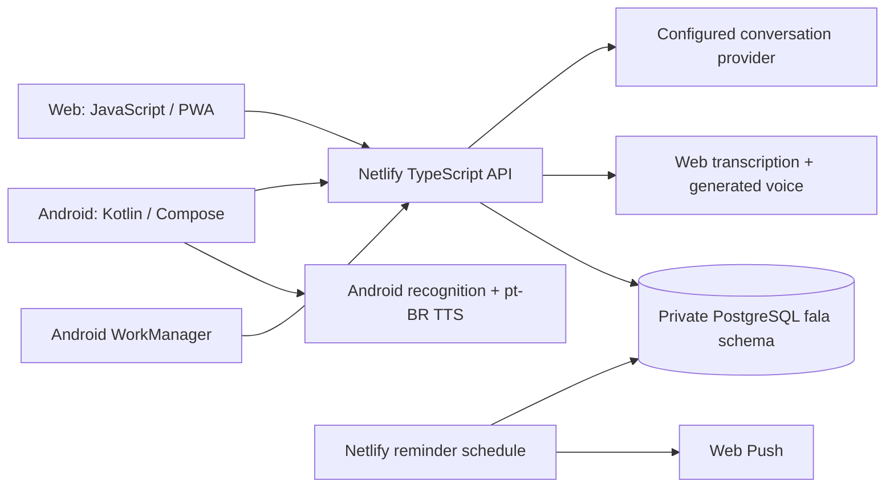

# Fala developer and agent handoff

Maintained for release 0.14.3, 26 September 2026. Start with [AGENTS.md](../AGENTS.md). Read [the release record](releases/0.14.3.md) for dated deployment/capacity evidence and [the release runbook](releasing.md) before publishing.

## What the product does

Fala teaches spoken Brazilian Portuguese through short conversations. Learners sign in with Google, choose Hebrew or English, choose everyday or capoeira practice and a speaking level, listen, hold to speak, review recognized words, then explicitly send. Reply ideas are editable assistance. A normal session has ten Portuguese replies, selective immediate feedback and a review with at most five vocabulary items.

Five practice levels concern Portuguese production, not capoeira expertise. XP, streaks, themes, microphone skins and capoeira character skins reward participation. Private friend circles share limited practice totals. The server owns eligibility and progress; clients do not award themselves points or unlocks.

The native Android app and the web app are separate clients. The web app can be used on iPhone; there is no native iOS binary in this repository. The coding assistant used to maintain this project is separate from the AI services used inside Fala.

## Current system



| Component | Source and responsibilities |
|---|---|
| HTTP API | `src/api.ts`, `netlify/functions/api.ts`: auth, validated routes, response format, timing |
| Identity | `src/auth.ts`: Google challenges/token verification, account ownership, hashed/revocable device sessions; browser HttpOnly cookies |
| Persistence | `src/database.ts`, `src/store.ts`: SQL, user-scoped reads, transactions, advisory locks, request-ID idempotency |
| Conversation flow | `src/service.ts`, `src/models.ts`: start/turn/help/finish contracts and orchestration |
| AI boundary | `src/provider.ts`, `src/ai-routing.ts`, `src/config.ts`: provider selection, hedging, cancellation, deadlines, structured responses and error handling |
| Teaching | `src/prompts.ts`, `src/coaching.ts`, `src/pedagogy.ts`: instructions, validation, reviewed question/reply models |
| Content/progress | `src/capoeira.ts`, `src/learning.ts`, `src/vocabulary.ts`: lessons, speaking-level qualification, grounded word reviews |
| Rewards/social | `src/rewards.ts`: account settings, XP, unlocks, circles, streaks, reminder claims |
| Reminders | `src/reminders.ts`, `netlify/functions/reminders.ts`: Web Push delivery and 15-minute production schedule |
| Content reports | `src/content-reports.ts`: reports about saved, server-owned AI content |
| Native session state | `android/app/src/main/java/com/fala/app/SessionController.kt` |
| Native screens | Same directory: `MainActivity.kt`, `RewardsUi.kt`, `InstructorsUi.kt`, walkthrough/help/update UI files |
| Native device services | `voice/`, `data/`, `ReminderWorker.kt`, `AppUpdates.kt`: speech, encrypted local session, permissions, scheduling and Play updates |
| Web UI | `public/app/index.html`, `app.css`, `app.js`, `rewards.js`, `partners.js`, `walkthrough.js` |
| Web speech/network | `public/app/voice.js`, `api.js`; server audio endpoints in `src/speech.ts` |
| Web offline shell | `public/app/sw.js`: public assets only; never cache authenticated API data or transcripts |
| Localization | `locales/he.json` → `scripts/localization.mjs` → web and Kotlin catalogs |
| Distribution | `.github/workflows/`, `scripts/play-*.mjs`, `scripts/release.mjs`, `netlify.toml` |
| Database changes | `supabase/migrations/*.sql`, applied in filename order to the confirmed database |

Release 0.14.3 runtime diagnostics verified paid OpenAI GPT-5.6 Luna conversation, OpenAI web transcription/voice and an explicitly configured Groq GPT-OSS 120B conversation backup. Daily app/user allowances are disabled; the per-account flood guard remains. Native speech uses Android's selected services. Inspect current authorized environment settings before asserting a live provider/model: defaults in code are not proof of deployed settings. Provider fallback is opt-in through `FALA_AI_FALLBACK_PROVIDER`; never add a route or move credentials between providers implicitly.

## Set up a fresh checkout

Use Node **22.22.2** from `.nvmrc`, npm **10.9.7**, Java **21**, Android SDK platform **36**, build tools **35.0.0**, and the checked-in Gradle **8.13** wrapper. Kotlin targets JVM 17; CI runs Java 21. Android supports API 26+.

From the repository root:

```bash
npx --yes npm@10.9.7 ci
npm test
npm run build
```

The normal Vitest suite uses an isolated PGlite database and mocked provider requests; no real AI keys are needed. It currently has 173 tests, but the count is a dated observation, not a contract. `build` type-checks, verifies shared catalogs and release metadata, and copies public files to `dist/`.

For browser changes:

```bash
npm run test:web
```

This runs the conversation, rewards/localization and notification-permission browser suites. Install Chrome/Chromium; tests default to `/usr/bin/google-chrome`. Set `FALA_TEST_CHROME` to another executable when needed. They create local HTTP servers and screenshots under ignored `artifacts/`.

For native changes:

```bash
cd android
./gradlew --no-daemon :app:testDebugUnitTest :app:assembleDebug :app:lintDebug
./gradlew --no-daemon :app:compileDebugAndroidTestKotlin
```

Compilation of instrumentation tests does not execute them. An emulator/phone is needed for connected tests and actual audio/permission/background-delivery checks. A debug APK is not signed for an existing Play installation.

CI additionally builds a release bundle, packages Netlify functions, and runs API tests against an isolated PostgreSQL 17 service using `FALA_TEST_DATABASE_URL`. Never point this destructive test fixture at production.

For local interactive development, copy `.env.example` to ignored `.env`, supply an authorized development database and Google configuration, apply its migrations, then run `npm run dev`. `FALA_DEMO=true` produces labeled scripted replies, not genuine AI teaching. `FALA_LOCAL_DATABASE=true` is only for a loopback development database. Android's service URL is compiled into its build configuration; users do not configure it.

## Existing workstation conveniences

These paths were available on the maintainer's Linux workstation; they are ignored and not needed on a fresh machine:

```bash
export GH_CONFIG_DIR="$PWD/.tools/github-cli/config"
.tools/github-cli/bin/gh auth status

npm_config_cache="$PWD/.tools/npm-cache" npx --offline --yes npm@10.9.7 ci

GRADLE_USER_HOME="$PWD/.tools/gradle-home" \
ANDROID_USER_HOME="$PWD/.tools/android-user-home" \
  .tools/gradle-8.13/bin/gradle --offline --no-daemon -p android \
  :app:testDebugUnitTest :app:assembleDebug :app:lintDebug
```

Use these only if the paths exist and the configured identity is the intended account. A default `gh auth status` can report no login while this explicit project CLI configuration is logged in. Do not print `hosts.yml`. Offline commands require populated caches; otherwise use a normal authorized network install.

Sandbox restrictions have previously blocked esbuild subprocesses, local browser listeners and Gradle sockets. Request the environment's normal execution permission for the specific build/check. That is not a dependency defect and does not justify changing package versions or repurposing `HOME`/`CODEX_HOME`.

## Behavioral invariants

- Only explicit Send submits an answer. Showing/selecting an idea records assistance without sending it. Hold/release, permission response and cancellation races must not start unwanted recording.
- Normal playback is 1.0; explicit slower playback is 0.45. A model's `pace` field must not silently slow normal Android playback. Prefer Brazilian voices; do not substitute pt-PT.
- UI language is account-level `reward_profiles.ui_language`. A saved session retains its original support language. Opening old history must not switch the whole interface.
- Hebrew interface layout is RTL. Portuguese questions, examples and entry remain LTR. User text, server translations and Portuguese phrases are not UI catalog keys.
- Generate both catalogs after editing `locales/he.json`. Exact English strings are source keys; changing an English label requires updating its key/translation. Keep placeholders intact. `npm run build` checks synchronization.
- Reminder defaults are enabled at 17:00 in the account time zone. Existing enabled custom times were preserved in the 0.14.0 migration. Subsequent opt-outs survive reruns. Permission, subscription/scheduling, no practice today and account/date deduplication still govern delivery.
- Difficulty stays at the most recently practised level. `next_level` is optional and never becomes the default automatically. Preserve the spaced-evidence safeguards and avoid session-count promises; see `docs/learning-progression.md`.
- Practice points are not proficiency. Current rewards cap at 20 XP per ten-answer spoken lesson and 40 per local day; legacy earned unlocks are preserved. Consult `src/rewards.ts` and the gamification document when changing this.
- Keep separate learners' SQL, memory, reports and AI context isolated. Idempotent retries reuse the original request ID and normalized payload; do not issue a fresh ID simply to retry a lost response.
- Preserve application ID `com.fala.app`, upload key, Play signing identity and Google OAuth certificate setup. No credential belongs in an app asset or public catalog.

## What changed in 0.14.3

Removed same-provider quota sleeps and native/web quota countdowns. Explicitly configured primary/backup generation uses one deadline and returns the first validated reply, cancelling the loser. The owner authorized paid services and requested capacity for 50 concurrent learners. Daily request allowances can be disabled with `0`; per-user flood protection remains. An operator-only, fixed synthetic probe supports capacity checks without accessing learner history. A real probe exposed inappropriate cord/rank offers; the final fix retains an explicit no-cord learner fact until a later personal update. See [service reliability](service-reliability.md) for configuration, billing/throughput planning and reproducible checks, and the release receipt for measured results. A passing 50-request burst is not sustained 50-learner voice capacity.

## What changed in 0.14.2

Removed the universal ten-turn hear/repeat-name script and the exact-term-on-every-turn requirement. Beginner openings now match the situation; continuations must respond to the learner's answer. Literal cord descriptions receive Hebrew/English meanings, and narrow validation guards cover the reported misuse and missing cord translations. Native progress numbers use LTR within Hebrew layout. No migration or provider switch is needed. See [lesson quality](lesson-quality.md) for root cause, acceptance examples and an opt-in synthetic evaluator. The live evaluation attempt was blocked before generation by a masked provider credential; do not claim live semantic or latency verification.

## What changed in 0.14.1

Removed automatic promotion after two conversations and replaced the countdown with supportive guidance and an optional challenge. Readiness requires consistent evidence on different dates and in different contexts. Intermediate goals no longer require a fixed number of sentences. Existing practice and chosen difficulty are retained; no database migration or additional AI call is needed. See [the progression specification](learning-progression.md). All maintained documentation is now in English.

## What changed in 0.14.0

1. Added a shared Hebrew UI catalog and selection across native/web screens, help, rewards, settings and accessibility labels. The selection persists in account settings; Portuguese practice stays Portuguese.
2. Added the `202609250001_language_reminders.sql` migration for account language and one-time default-on reminder setup. Android asks for notification permission on Home; web requests permission from a user gesture and avoids repeated prompts after denial/disconnection.
3. Reviewed beginner question models now carry context-matching answer ideas. Validation rejects the same pair after a changed question, while allowing appropriate repair/help repetition. Prompts explain the rule.
4. Native automatic playback no longer applies the AI's slow-pace flag to normal Listen. Web speech instructions request a natural pace; explicit Slow remains available.
5. Added backend, localization, browser and native checks and the required visible version/release notes. [The release record](releases/0.14.0.md) lists actual publication evidence.

The local 0.13.8 notes represent the initial answer/playback fix prepared during this work. That intermediate version was not separately published; its changes shipped with 0.14.0. Previous notes were preserved.

## Open issues and limits

- The corrected 0.14.3 fixed synthetic burst returned 50/50 replies; end-to-end median was 3.674 seconds and p95 6.943 seconds. The below-three-second target was not met. AI time was 1.617 seconds median / 1.810 seconds p95; do not confuse handler timing with user latency. Transport, cold initialization and platform queuing still need separate measurement.
- Actual OpenAI limits were 500 RPM / 500,000 TPM. Groq backup remained at 8,000 TPM / 1,000 RPD and returned 24 observed 429s in the corrected burst. Paid access and disabled daily app allowances do not establish sustained capacity or a backup capable of carrying all 50 learners. The release receipt documents the existing-account capacity upgrade required from the owner.
- `npm run benchmark` measures authenticated read-only endpoints. Use the explicitly enabled fixed operator probe for actual AI capacity without extracting provider secrets. The optional full-session check requires a dedicated test-only learner account; it must not use the operator's legacy history or a real learner account. Physical speech and the changed web transcription route were not tested with real audio.
- 0.14.3 native unit/build/lint checks passed; instrumentation was compiled. No physical device was connected for new phone audio, notification-delivery or Play-install checks. Older captures remain historical evidence only.
- Read the latest release receipt and current Play state before claiming tester availability. A completed track transaction can still have a separate `IN_REVIEW` lifecycle.
- Scheduled reminders are best effort. The current scheduler processes bounded batches; review capacity before expanding the audience. There is no promise of an alarm exactly at 17:00.
- Hebrew UI does not establish eligibility for young children. Keep existing access/consent behavior and consult the separate children/provider rollout work before changing it.

When finishing work, describe the resulting behavior, checks and unverified limits; update relevant docs and keep publication status factual.
