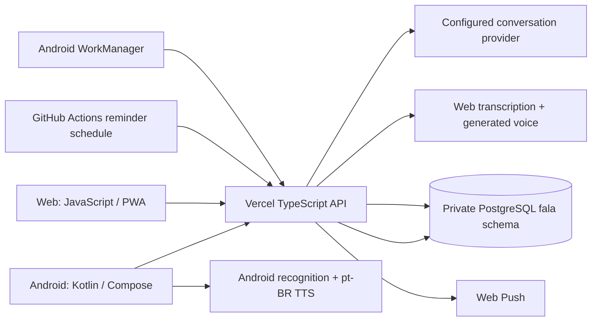

# Fala developer and agent handoff

Maintained for release 0.15.0, 27 September 2026. Start with [AGENTS.md](../AGENTS.md). Read [the release record](releases/0.15.0.md) for dated deployment/capacity evidence and [the release runbook](releasing.md) before publishing.

## What the product does

Fala teaches spoken Brazilian Portuguese through short conversations. Learners sign in with Google, choose Hebrew or English, choose everyday or capoeira practice and a speaking level, listen, hold to speak, review recognized words, then explicitly send. Reply ideas are editable assistance. A normal session has ten Portuguese replies, selective immediate feedback and a review with at most five vocabulary items.

Five practice levels concern Portuguese production, not capoeira expertise. XP, streaks, themes, microphone skins and capoeira character skins reward participation. Private friend circles share limited practice totals. The server owns eligibility and progress; clients do not award themselves points or unlocks.

The native Android app and the web app are separate clients. The web app can be used on iPhone; there is no native iOS binary in this repository. The coding assistant used to maintain this project is separate from the AI services used inside Fala.

## Current system


```mermaid
flowchart LR
  Android[Android: Kotlin / Compose] --> API[Vercel TypeScript API]
  Browser[Web: JavaScript / PWA] --> API
  Android --> NativeSpeech[Android recognition + pt-BR TTS]
  API --> Coach[Configured conversation provider]
  API --> Audio[Web transcription + generated voice]
  API --> DB[(Private PostgreSQL fala schema)]
  Scheduler[GitHub Actions reminder schedule] --> API
  API --> DB
  API --> Push[Web Push]
  Worker[Android WorkManager] --> API
```

| Component | Source and responsibilities |
|---|---|
| HTTP API | `src/api.ts`, `deploy/vercel-api/handler.ts`: auth, validated routes, response format, timing; Vercel is the only live host |
| Identity | `src/auth.ts`: Google challenges/token verification, account ownership, hashed/revocable device sessions; browser HttpOnly cookies |
| Persistence | `src/database.ts`, `src/store.ts`: SQL, user-scoped reads, transactions, advisory locks, request-ID idempotency |
| Conversation flow | `src/service.ts`, `src/models.ts`: start/turn/help/finish contracts and orchestration |
| AI boundary | `src/provider.ts`, `src/ai-routing.ts`, `src/config.ts`: provider selection, hedging, cancellation, deadlines, structured responses and error handling |
| Teaching | `src/prompts.ts`, `src/coaching.ts`, `src/pedagogy.ts`: instructions, validation, reviewed question/reply models |
| Content/progress | `src/capoeira.ts`, `src/learning.ts`, `src/vocabulary.ts`: lessons, speaking-level qualification, grounded word reviews |
| Rewards/social | `src/rewards.ts`: account settings, XP, unlocks, circles, streaks, reminder claims |
| Reminders | `src/reminders.ts`, `src/reminder-handler.ts`, `.github/workflows/reminders.yml`: Web Push delivery and authenticated 15-minute schedule |
| Content reports | `src/content-reports.ts`: reports about saved, server-owned AI content |
| Native session state | `android/app/src/main/java/com/fala/app/SessionController.kt` |
| Native screens | Same directory: `MainActivity.kt`, `RewardsUi.kt`, `InstructorsUi.kt`, walkthrough/help/update UI files |
| Native device services | `voice/`, `data/`, `ReminderWorker.kt`, `AppUpdates.kt`: speech, encrypted local session, permissions, scheduling and Play updates |
| Web UI | `public/app/index.html`, `app.css`, `app.js`, `rewards.js`, `partners.js`, `walkthrough.js` |
| Web speech/network | `public/app/voice.js`, `api.js`; server audio endpoints in `src/speech.ts` |
| Web offline shell | `public/app/sw.js`: public assets only; never cache authenticated API data or transcripts |
| Localization | `locales/he.json` → `scripts/localization.mjs` → web and Kotlin catalogs |
| Distribution | `.github/workflows/`, `scripts/play-*.mjs`, `scripts/release.mjs`, `deploy/vercel-api/vercel.json` |
| Database changes | `supabase/migrations/*.sql`, applied in filename order to the confirmed database |

Release 0.14.3 runtime diagnostics verified paid OpenAI GPT-5.6 Luna conversation, OpenAI web transcription/voice and an explicitly configured Groq GPT-OSS 120B conversation backup. Daily app/user allowances are disabled; the per-account flood guard remains. Native speech uses Android's selected services. Inspect current authorized environment settings before asserting a live provider/model: defaults in code are not proof of deployed settings. Provider fallback is opt-in through `FALA_AI_FALLBACK_PROVIDER`; never add a route or move credentials between providers implicitly.

## Set up a fresh checkout

Use Node **22.22.2** from `.nvmrc`, npm **10.9.7**, Java **21**, Android SDK platform **36**, build tools **35.0.0**, and the checked-in Gradle **8.13** wrapper. Kotlin targets JVM 17; CI runs Java 21. Android supports API 26+.

From the repository root:

```bash
npx --yes npm@10.9.7 ci
npm test
npm run build
```

The normal Vitest suite uses an isolated PGlite database and mocked provider requests; no real AI keys are needed. The 0.15.0 main check passed 221 tests and skips one explicitly opt-in PostgreSQL concurrency test. Coverage includes local loopback fixtures, dashboard timing extraction, invocation tracking and the isolated Vercel probe routing/guard/safe error categories; the count is a dated observation, not a contract. `build` type-checks, verifies shared catalogs and release metadata, and copies public files to `dist/`.

For browser changes:

```bash
npm run test:web
```

This runs four browser suites: conversation, rewards/localization, notification permissions and an offline historical service-worker migration fixture. Install Chrome/Chromium; tests default to `/usr/bin/google-chrome`. Set `FALA_TEST_CHROME` to another executable when needed. They create local HTTP servers and screenshots under ignored `artifacts/`.

For native changes:

```bash
cd android
./gradlew --no-daemon :app:testDebugUnitTest :app:assembleDebug :app:lintDebug
./gradlew --no-daemon :app:compileDebugAndroidTestKotlin
```

Compilation of instrumentation tests does not execute them. An emulator/phone is needed for connected tests and actual audio/permission/background-delivery checks. A debug APK is not signed for an existing Play installation.

CI additionally builds a release bundle, installs and type-checks the isolated Vercel deployment package, and runs API tests against an isolated PostgreSQL 17 service using `FALA_TEST_DATABASE_URL`. It then creates a separate `fala_concurrency_test` database and uses `FALA_CONCURRENCY_DATABASE_URL` to run the [50-account full-session test](session-concurrency-2026-09-27.md), retaining sanitized timing aggregates as an artifact. That test passed locally with real PostgreSQL and controlled fake generation. Never point either destructive fixture at production.

For local interactive development, copy `.env.example` to ignored `.env`, supply an authorized development database and Google configuration, apply its migrations, then run `npm run dev`. `FALA_DEMO=true` produces labeled scripted replies, not genuine AI teaching. `FALA_LOCAL_DATABASE=true` is only for a loopback development database. Android's service URL is compiled into its build configuration; users do not configure it.

## Existing workstation conveniences

These paths were available on the maintainer's Linux workstation; they are ignored and not needed on a fresh machine:

```bash
export GH_CONFIG_DIR="$PWD/.tools/github-cli/config"
.tools/github-cli/bin/gh auth status

npm_config_cache="$PWD/.tools/npm-cache" npx --offline --yes npm@10.9.7 ci

GRADLE_USER_HOME="$PWD/.tools/gradle-home" \
ANDROID_USER_HOME="$PWD/.tools/android-user-home" \
  .tools/gradle-8.13/bin/gradle --offline --no-daemon -p android \
  :app:testDebugUnitTest :app:assembleDebug :app:lintDebug
```

Use these only if the paths exist and the configured identity is the intended account. A default `gh auth status` can report no login while this explicit project CLI configuration is logged in. Do not print `hosts.yml`. Offline commands require populated caches; otherwise use a normal authorized network install.

Sandbox restrictions have previously blocked esbuild subprocesses, local browser listeners and Gradle sockets. Request the environment's normal execution permission for the specific build/check. That is not a dependency defect and does not justify changing package versions or repurposing `HOME`/`CODEX_HOME`.

## Behavioral invariants

- Only explicit Send submits an answer. Showing/selecting an idea records assistance without sending it. Hold/release, permission response and cancellation races must not start unwanted recording.
- Normal playback is 1.0; explicit slower playback is 0.45. A model's `pace` field must not silently slow normal Android playback. Prefer Brazilian voices; do not substitute pt-PT.
- UI language is account-level `reward_profiles.ui_language`. A saved session retains its original support language. Opening old history must not switch the whole interface.
- Hebrew interface layout is RTL. Portuguese questions, examples and entry remain LTR. User text, server translations and Portuguese phrases are not UI catalog keys.
- Generate both catalogs after editing `locales/he.json`. Exact English strings are source keys; changing an English label requires updating its key/translation. Keep placeholders intact. `npm run build` checks synchronization.
- Reminder defaults are enabled at 17:00 in the account time zone. Existing enabled custom times were preserved in the 0.14.0 migration. Subsequent opt-outs survive reruns. Permission, subscription/scheduling, no practice today and account/date deduplication still govern delivery.
- Difficulty stays at the most recently practised level. `next_level` is optional and never becomes the default automatically. Preserve the spaced-evidence safeguards and avoid session-count promises; see `docs/learning-progression.md`.
- Practice points are not proficiency. Current rewards cap at 20 XP per ten-answer spoken lesson and 40 per local day; legacy earned unlocks are preserved. Consult `src/rewards.ts` and the gamification document when changing this.
- Keep separate learners' SQL, memory, reports and AI context isolated. Idempotent retries reuse the original request ID and normalized payload; do not issue a fresh ID simply to retry a lost response.
- Preserve application ID `com.fala.app`, upload key, Play signing identity and Google OAuth certificate setup. No credential belongs in an app asset or public catalog.

## Vercel-only hosting maintenance

On 27 September 2026, after 0.15.0, the owner required complete Netlify retirement. Its Fala project was disabled and unlinked from GitHub; old routes return 404. Build tooling, diagnostic defaults and fresh-machine instructions now use Vercel without a Netlify login. The existing 0.15.0 client points directly to Vercel and needs no new Android binary for this maintenance. See [the retirement receipt](netlify-retirement-2026-09-27.md).

## What changed in 0.15.0

The owner requested 0.15.0 as the visible Vercel milestone; the actual hosting cutover shipped in 0.14.4. The website is live on 0.15.0, and build 104601 was accepted in Internal Testing and closed Alpha on 27 September 2026. Alpha was `IN_REVIEW` at 12:47 UTC; recheck the current lifecycle before promising tester availability. This version fixes the Android home card that always read the first memory item. `Store.progress()` now derives `review_phrase` from recent account-owned corrections/help and completed-session vocabulary, with deterministic rotation as UTC days and completed conversations change. Both clients use the same field and label it as an optional phrase from prior practice, not today's lesson. Empty/expired history hides the card. See [learning progression](learning-progression.md#home-review-phrase-0150) for selection rules and [the release receipt](releases/0.15.0.md) for publication state. No database migration, provider change or new VAPID pair is required.

## What changed in 0.14.4

The live primary website/API is `https://fala-api.vercel.app`. Version 0.14.4, build 104501, was verified in Internal Testing and submitted to closed Alpha on 27 September 2026; Alpha was `IN_REVIEW`. See the [release receipt](releases/0.14.4.md) for source/deployment IDs and workflow evidence, and recheck Google before claiming later approval. Netlify forwarding was subsequently retired at the owner's request; the old host is disabled and its legacy browser Origin exception is removed. Never trust forwarded host headers for cookie authorization. Android migrates only approved old service origins, retaining the encrypted login against the same database.

`Store.generate()` commits an account-scoped generation claim in a short transaction, releases the SQL connection while calling AI, then verifies claim ownership and the unchanged snapshot before saving/rewarding. The additive `202609270001_generation_claims.sql` migration must precede this API. Expired claims, concurrent mutations, replay IDs, account deletion and stale results have regression coverage. Do not reintroduce a transaction spanning a provider request.

Web displays the saved response directly using `X-Fala-Turn-Id`; missing headers retain the older API's GET fallback. Continuation prompts identify the answered question and prior ideas. Immediate loops remain invalid, while familiar questions can return after two intervening exchanges. Final-turn instructions must close the lesson without another question.

Web Push uses a new matching key pair already installed in Vercel Production because the previous private key was unavailable. See [reminder operations](reminders.md) for storage, rotation and troubleshooting; do not regenerate keys for ordinary releases. Subscription JSON records the public key; delivery selects only matching subscriptions and does not consume a reminder claim for another key. The new website origin requires Google login and notification permission again. Preserve account reminder times/opt-outs. A dedicated `FALA_REMINDER_TOKEN`, shared only by Vercel and GitHub Actions, protects `/internal/reminders`; the retired Netlify scheduler must not run concurrently.

For deployment, stage with `node scripts/prepare-vercel-api.mjs`, explicitly link the stage to `fala-api` in `gdarmon-4173`, and deploy through the authorized Vercel CLI. Never upload the full checkout or `.env`. See the runbook for exact steps. `FALA_SESSION_DIAGNOSTICS=true` is temporary operator-only access to synthetic accounts in `fala_latency_probe`; turn it off after the bounded load test and redeploy. Normal `/diagnostics` remains operator authenticated.

## What changed in 0.14.3

Removed same-provider quota sleeps and native/web quota countdowns. Explicitly configured primary/backup generation uses one deadline and returns the first validated reply, cancelling the loser. The owner authorized paid services and requested capacity for 50 concurrent learners. Daily request allowances can be disabled with `0`; per-user flood protection remains. An operator-only, fixed synthetic probe supports capacity checks without accessing learner history. A real probe exposed inappropriate cord/rank offers; the final fix retains an explicit no-cord learner fact until a later personal update. See [service reliability](service-reliability.md) for configuration, billing/throughput planning and reproducible checks, and the release receipt for measured results. A passing 50-request burst is not sustained 50-learner voice capacity.

## What changed in 0.14.2

Removed the universal ten-turn hear/repeat-name script and the exact-term-on-every-turn requirement. Beginner openings now match the situation; continuations must respond to the learner's answer. Literal cord descriptions receive Hebrew/English meanings, and narrow validation guards cover the reported misuse and missing cord translations. Native progress numbers use LTR within Hebrew layout. No migration or provider switch is needed. See [lesson quality](lesson-quality.md) for root cause, acceptance examples and an opt-in synthetic evaluator. The live evaluation attempt was blocked before generation by a masked provider credential; do not claim live semantic or latency verification.

## What changed in 0.14.1

Removed automatic promotion after two conversations and replaced the countdown with supportive guidance and an optional challenge. Readiness requires consistent evidence on different dates and in different contexts. Intermediate goals no longer require a fixed number of sentences. Existing practice and chosen difficulty are retained; no database migration or additional AI call is needed. See [the progression specification](learning-progression.md). All maintained documentation is now in English.

## What changed in 0.14.0

1. Added a shared Hebrew UI catalog and selection across native/web screens, help, rewards, settings and accessibility labels. The selection persists in account settings; Portuguese practice stays Portuguese.
2. Added the `202609250001_language_reminders.sql` migration for account language and one-time default-on reminder setup. Android asks for notification permission on Home; web requests permission from a user gesture and avoids repeated prompts after denial/disconnection.
3. Reviewed beginner question models now carry context-matching answer ideas. Validation rejects the same pair after a changed question, while allowing appropriate repair/help repetition. Prompts explain the rule.
4. Native automatic playback no longer applies the AI's slow-pace flag to normal Listen. Web speech instructions request a natural pace; explicit Slow remains available.
5. Added backend, localization, browser and native checks and the required visible version/release notes. [The release record](releases/0.14.0.md) lists actual publication evidence.

The local 0.13.8 notes represent the initial answer/playback fix prepared during this work. That intermediate version was not separately published; its changes shipped with 0.14.0. Previous notes were preserved.

## Open issues and limits

- The [SQL concurrency fix](session-concurrency-2026-09-27.md) reduced controlled local transaction acquisition p95 from 1,357.1 to 195.0 ms with a 25 ms fake provider; all 50 sessions completed. This is not a real-AI user latency number. After fixing continuation context, structured-language generation and recent-question guidance, the final real full-session check completed 50/50 sessions and 600/600 generation operations (p50 2.487 s/p95 3.316 s; answer-only p95 3.056 s). Only two operations needed another generation. The strict p95 < 3 s gate still failed (exit 2); phone audio and continuous 50-learner voice capacity remain unverified. Earlier failed runs and the remaining Groq backup limits are retained in the 0.14.4 receipt. Check that receipt for actual traffic/Play publication status before making deployment claims.
- The [isolated Vercel comparison](vercel-probe-2026-09-27.md) ran on the owner's `gdarmon-4173` Hobby account with Node 22/Fluid in `cle1`. The owner's Transaction pooler update resolved DNS/database access; a concrete `api/probe.ts` entrypoint fixed the probe's nested POST routing. All 400 synthetic requests succeeded across two runs per host in reversed order. Second-wave p95 was 2.40–2.45 s on Vercel versus 4.01–4.12 s on Netlify, with similar AI medians. The first Vercel wave still failed the three-second gate, and individual outliers remained. All 200 Netlify IDs matched Observability; the slowest request had 6.086 s reported before its instance's eighth invocation. Vercel source `126b738`, deployment `dpl_AVf9xeR6YpsTK4iQ7cdZzZhPgiS2`; `.tools/vercel-cli/node_modules/.bin/vercel` 60.1.3 remains signed in. The owner explicitly approved disabling Vercel SSO only for this test project; operator authentication/learner-route guards remain. This historical short-request comparison is separate from the subsequent full-session production release in the 0.14.4 receipt.
- The [invocation-reuse experiment](latency-invocation-reuse-2026-09-27.md) on an isolated instrumented draft found all 50 second-wave requests used instances observed in wave one, yet p50 was 3.49 s and p95 4.23 s. A third invocation in the same instance had 4.12 s reported before function execution. First application initialization is therefore insufficient to explain the tail. Operator-only runtime metadata exists on the draft, not production; do not equate its `first_invocation` flag with a platform cold-start timer. All 100 request IDs matched Observability. At that experiment, production remained on 0.14.3 deployment `6ab79231ad32f40008ab8dbe`.
- The [27 September live Observability test](latency-investigation-2026-09-27.md) matched all 105 requests across 50/25/30 bursts to the dashboard's exact request details. In the 50 burst, 0/50 finished below three seconds (p50 5.29 s, p95 7.16 s). The slowest Netlify request lasted 7.09 s but its function operation only 1.81 s, with 5.16 s reported before invocation. A hard limit of 25 was not established by the smaller comparisons. The historical Netlify-only collector is retained in Git history at `bb13723`; it is no longer an operational dependency. That experiment alone did not demonstrate a migration or paid-plan fix.
- The below-three-second target remains unmet. A [later 26 September investigation](latency-investigation-2026-09-26.md) separated client connection/body time and matched all 50 request IDs from one live burst to Netlify logs. A 7.17-second request began platform invocation about 5.24 seconds after client start and executed in 1.84 seconds. Long delays also persisted on reused connections and HTTP/2. On that historical Netlify deployment, delayed dispatch/invocation was the dominant reproduced tail; its exact internal cause still needs provider confirmation. The current Vercel measurements above supersede those timings for current-release performance claims. Some initial requests also show extra initialization/wrapper work. Use `scripts/check-latency.mjs` against Vercel; a successful HTTP count alone no longer passes the detailed latency gate.
- Actual OpenAI limits were 500 RPM / 500,000 TPM. Groq backup remained at 8,000 TPM / 1,000 RPD and returned 24 observed 429s in the corrected burst. Paid access and disabled daily app allowances do not establish sustained capacity or a backup capable of carrying all 50 learners. The release receipt documents the existing-account capacity upgrade required from the owner.
- `npm run benchmark` measures authenticated read-only endpoints. Use the explicitly enabled fixed operator probe for actual AI capacity without extracting provider secrets. The optional full-session check requires a dedicated test-only learner account; it must not use the operator's legacy history or a real learner account. One synthetic generated-audio round trip passed; no physical microphone/phone end-to-end check was performed.
- 0.14.4 native unit/build/lint checks passed; instrumentation was compiled. No physical device was connected for new phone audio, notification-delivery or Play-install checks. Older captures remain historical evidence only.
- Read the latest release receipt and current Play state before claiming tester availability. A completed track transaction can still have a separate `IN_REVIEW` lifecycle.
- Scheduled reminders are best effort. The current scheduler processes bounded batches; review capacity before expanding the audience. There is no promise of an alarm exactly at 17:00.
- Hebrew UI does not establish eligibility for young children. Keep existing access/consent behavior and consult the separate children/provider rollout work before changing it.

When finishing work, describe the resulting behavior, checks and unverified limits; update relevant docs and keep publication status factual.
