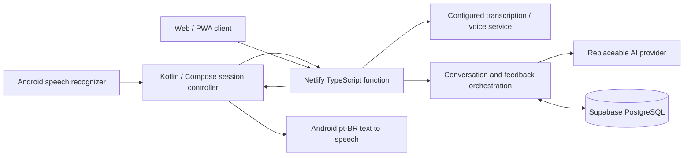

# Fala — Brazilian Portuguese conversation practice

The project began with a native Android architecture on 18 September 2026 and now includes the web client, rewards, reminders and shared localization. This document retains detailed design rationale; [the current handoff](agent-handoff.md) provides the full source map and [the release record](releases/0.14.0.md) records verified 0.14.0 behavior. The adjacent `chatbot` project supplied a provider configuration convention, not its database or features.

## A–C. Architecture, stack, and structure



One Android application and one private API function, deployable directly from GitHub to Netlify. Node 22, TypeScript, Zod for validating requests/model output, and PostgreSQL transactions for persistence. Kotlin, Compose, coroutines, and OkHttp on Android. Provider-specific code stays out of session management. Static public pages and the full web/PWA client are published alongside the separately bundled API functions.

```
android/app/src/main/java/com/fala/app/
  MainActivity.kt          simple screens and permission request
  SessionController.kt     voice/session state and lifecycle
  data/                    HTTP API and device connection settings
  voice/                   STT and TTS interfaces + Android adapters
netlify/functions/api.ts   function entry and warm connection reuse
src/
  api.ts                   authentication and HTTP routes
  config.ts                server-only configuration
  auth.ts                  Google token verification, nonces, hashed sessions, login limits
  models.ts                validated contracts
  provider.ts              AI interface and compatible HTTP adapter
  prompts.ts               Brazilian conversation and coaching rules
  service.ts               session orchestration
  store.ts                 PostgreSQL transactions and learner memory
  database.ts              transaction-pooler-compatible connection
supabase/migrations/       private schema, constraints, indexes, RLS
tests/                     PostgreSQL-backed API and provider checks
public/                    static pages, branding and the full app/ web client
docs/
```

## D–E. MVP and exclusions

MVP: onboarding and microphone permission, a short adaptive spoken assessment, one Talk action, turn-based voice conversation with hold-to-speak capture and explicit sending, remembered English/Hebrew translations, two translated reply ideas, editable recognition results, and English/Hebrew rescue, session history, up to three corrections, personal mistake memory, and progress based on real sessions.

There is no native iOS client; iPhone users use the web app. Subscriptions, fully offline conversation, automatic simultaneous barge-in, streaming speech-to-speech and phoneme-level pronunciation scores are not implemented. Practice XP, cosmetics and private circles were added after the original MVP; see [gamification](gamification.md). Google Credential Manager sign-in identifies each learner by the signed Google subject, never by email. A one-time server nonce prevents login replay. Device sessions are random, hashed in PostgreSQL, encrypted by Android Keystore, revocable, and expire after 90 days. All learner reads, writes, history, aggregates and AI context are scoped to the authenticated user. Google client IDs and service URLs are public configuration; provider/database/operator secrets remain server-side.

Public signup has per-IP/global login throttles. AI endpoints have a 120-request/minute per-user flood guard and configurable per-user/app daily limits; `0` disables a daily limit. These constrain requests, not monetary spending. The optional operator token accesses diagnostics and the isolated legacy learner.

## F–G. Risks and voice architecture

`SpeechInput` and `SpeechOutput` are replaceable interfaces. The first adapters use Android SpeechRecognizer and TextToSpeech with explicit pt-BR. A Brazilian voice is required; do not silently select pt-PT. Prefer on-device recognition when available; the user may opt into their installed network recognition service. Language support is device-dependent; offer retry/settings rather than fabricate transcripts.

State: ready → requesting → speaking → your turn → holding/listening → recognizing → editable draft → explicit send. Fala speaks first; its Portuguese question and translation stay visible unless the learner chooses Listen first. Question text and answer ideas can be revealed separately; exposing ideas keeps the pending answer marked as assisted. The composer remains at the bottom while the question and ideas scroll. Playback never opens the microphone. Holding interrupts playback and starts recognition; release stops capture. Engines that finalize at pauses may restart only while the press is still held. A 45-second limit and an 8-second final-result timeout prevent stuck capture. Recognized words, including low-confidence results, are reviewed before sending; typing remains available. Delayed permission responses cannot start a released gesture. Silence leaves a local message by the composer. Backgrounding stops audio and invalidates callbacks; foregrounding never restarts capture.

Playback waits up to eight seconds for initial TTS readiness, uses media audio and volume controls, and lets the learner hear individual suggestions or summary words. Stopping or backgrounding cancels queued speech.

The native application creates or uploads no audio files. The web client separately sends its recorded clip to the configured transcription endpoint; see [web behavior](web-app.md). Android's selected speech service may send audio to its provider; disclose this before consent. Native conversation requests contain transcripts, not recordings; separate web audio endpoints handle transcription and generated playback. No reliable pronunciation claim can be made from these transcripts. Speech duration is an approximate measurement between recognition speech callbacks, not a precision fluency score.

Primary risks: recognition errors mistaken for learner errors, unsupported pt-BR voices, cellular latency, platform audio interruptions, and model overcorrection. Initial objective: ten consecutive voice turns on a real Android phone without typing. Measure recognition-to-playback latency on the device; do not promise a latency target before measurement.

## H. AI conversation architecture

The AI provider accepts a task, bounded session context, current learner profile, and at most three due weaknesses. It returns validated structured data. The initial adapter implements the Chat Completions wire format, matching the existing chatbot's Groq setup. URL, key, and model are runtime server settings. No vendor SDK or provider key is bundled in Android.

Conversation instructions follow a saved practice difficulty from 1 to 5. Current level 1 questions and ideas are limited to seven words (`src/learning.ts`); later levels invite simple sentences, connected ideas and concise explanations within larger maximum lengths, without a learner-facing sentence quota. Each session freezes its level in request JSON, preserving retry/resume semantics. The learner stays at the most recently practised difficulty and can choose a harder or easier task. Repeated independent evidence across days and contexts can support an optional next-level suggestion; it never automatically raises difficulty. The server owns qualification; guided, copied, typed, repeated and demo answers cannot manufacture advancement. See [the exact progression method](learning-progression.md). These are app practice levels, not CEFR grades. Capoeira mode focuses on classroom instruction and clarification, with verbal responses rather than physical coaching. Pronunciation is not scored from text.

The [ABADÁ curriculum](abada-curriculum.md) rotates lesson themes from each learner’s retained non-demo history. A versioned lesson ID and visit number are frozen in request JSON; server-generated topic labels describe the theme. Only the current lesson vocabulary, current speaking task and five recent opening texts supplement the existing context. The model must vary open questions, confirmations and a choice instead of repeating one template. Vocabulary extraction preserves whole known capoeira expressions, and prior exposure matches those phrases and aliases within the learner’s own actual dialogue. No migration or Android update is required.

Help is a distinct turn type. The learner expresses intent in English or Hebrew; the model produces a natural Portuguese sentence, one brief explanation, and an invitation to say it. The next turn is Portuguese practice, not another translation. Assistance is recorded separately from spontaneous production. The support language is saved in the session request, so resumed conversations keep their original language. Turn request JSON records speech/typed source and an assistance marker without new database columns. Typed replies have zero speaking time. Guided answers and exact repetitions of the previous suggestions/practice phrase are excluded from spontaneous assessment evidence; at least five independent spoken replies are required for a CEFR estimate.

Every Portuguese answer receives a brief immediate confirmation, clarification, guided-practice acknowledgement, or one grounded correction. A correction must quote the current answer and its natural wording must appear in spoken playback. Groq GPT-OSS and supported OpenAI GPT-5.6 models use a strict generated JSON schema so answer feedback cannot be omitted; other compatible providers retain JSON mode. Prior translated feedback and older answer ideas are omitted from the AI context to reduce copying and input size. Only the latest answer ideas are retained. Explicitly configured provider fallback starts immediately on a failure, or after a 1200 ms hedge for a slow primary. The first validated result wins. The same saturated route is never delayed and retried; clients add no quota countdown. Both routes and repairs share one eight-second default deadline. Longer questions, stacked questions, mixed scripts, and missing feedback are rejected and may regenerate once within the original AI deadline. The tenth answer receives a closing response without another question or suggestions; help requests do not advance this count. Android fetches the summary while the closing voice plays, then shows it when playback completes or fails. A retry reuses the same answer request ID.

End-of-session feedback is separate and limited to three evidenced corrections. Quotes must occur in the learner's actual Portuguese turns. No-op corrections are dropped. Valid expressions such as “Eu tenho 44 anos” must not be corrected. No minimum correction count: a clean session should stay clean. Review phrases come from accepted corrections or help requests; never fill a quota with random vocabulary. Summary pointers use the selected support language. Vocabulary is tokenized from actual Portuguese partner text and non-help learner replies. Translations and help-language input are excluded. A separately spoken corrected phrase is counted once, including when it is already part of the question text. The AI translates the supplied word list; the server computes counts and checks prior exposure through user-scoped retained sessions. At most five useful words are selected, favoring relevant new-to-history words, corrections and repetition while excluding fillers and some duplicate inflections. Unused suggestions are excluded because they may be hidden. These are exposure records, not mastery scores. Older reports are compacted at read time, without deleting their saved content. New metadata uses existing reply/feedback JSON columns; no migration is needed.

## I. Learner memory and deletion

PostgreSQL entities in the private `fala` schema include `users`, `device_sessions`, `login_challenges`, `auth_rate_limits`, `usage_limits`, and the learning tables below. Sessions reference their owning user; `(user_id, request_id)` is unique. Original single-user records belong to a separate legacy operator account.

Learning tables:

| Entity | Stored information |
|---|---|
| Session | ID, kind, topic, start/end, provisional assessment and feedback |
| Turn | Stable request ID, learner/partner text, help flag, approximate speech milliseconds |
| Mistake evidence | Source session, source quote, natural phrasing, category, stable construction key, explanation, example |
| Profile | Latest assessment derived from retained sessions; no assumed starting CEFR |

Mistakes are aggregated by normalized construction key. Occurrences count distinct sessions, not repeated processing. Due dates bring weaknesses into later natural conversations. Initial recurrence uses a conservative next-day schedule; successful retrieval and interval expansion are a later phase, not a claimed feature. Help situations remain visible in session history and progress. Review material is tied to its source evidence.

Deleting a session cascades to its turns and memory evidence; aggregates and profile are recomputed. Delete-all removes only the signed-in learner's records. Account deletion also removes their user row and all device sessions; cascades remove their conversations/evidence. Other learners are unaffected. This is logical database deletion, not physical erasure of PostgreSQL storage, backups, or external provider logs. Configure backup retention separately. Application code does not log transcripts or raw database/provider errors. Android backup is disabled, and the device access token is encrypted with Android Keystore.

Every mutation takes a transaction-scoped PostgreSQL advisory lock derived from the authenticated user ID. After locking it verifies the account still exists, preventing an in-flight request from recreating data after account deletion. This coordinates independent Netlify instances through Supabase's transaction pooler. Request IDs and original normalized payloads make start/turn retries idempotent; conflicting reuse returns 409. Report and evidence writes commit together. For each learner, a short transaction spans the bounded AI call; no transaction stays open between spoken turns. The DB lock is tried without waiting, so competing requests can retry. A module-scoped pool uses at most one connection per warm instance with prepared statements disabled. Different learners use different locks. Database connection capacity and production throughput still require load measurement; no multiuser scale guarantee is made.

Supabase's public roles have no access to `fala`; all tables have RLS enabled with no public policies. A server-only owner connection accesses them. No Supabase secret or AI key is sent to Android. Connection setup is in [deployment](deployment.md), including Personal-plan region constraints and Haifa latency measurements.

## J. Phases and acceptance

1. **Voice slice:** Android build; connect; Talk; ten real spoken turns; denial, silence, interrupted playback, network failure, and resume behavior.
2. **Coaching:** short assessment; rescue in English and Hebrew; return to spoken Portuguese; no correction of valid age statements.
3. **Memory:** idempotent feedback; evidenced mistakes reappear in context; history/progress; session/all-data deletion verified across restarts.
4. **Device validation:** real phone and speaker/headset tests; Brazilian voice selection; network changes; latency measurement; private installation instructions.

Automated server tests can validate orchestration, privacy, persistence, and provider failure behavior. They cannot validate microphone recognition, Brazilian voice naturalness, or conversational quality on a physical device.

## Sources checked

- [Android speech recognition](https://developer.android.com/reference/android/speech/SpeechRecognizer)
- [Android speech playback](https://developer.android.com/reference/android/speech/tts/TextToSpeech)
- [AGP 8.13 compatibility](https://developer.android.com/build/releases/agp-8-13-0-release-notes)
- [Structured JSON output](https://developers.openai.com/api/docs/guides/structured-outputs) — application validation remains necessary.
- [Provider data controls](https://developers.openai.com/api/docs/guides/your-data) — disabling application storage is not a guarantee of zero provider retention.
- [Groq reasoning configuration](https://console.groq.com/docs/reasoning) — Groq GPT-OSS uses low reasoning effort; OpenAI GPT-5.6 Luna uses none. The shared request deadline remains enforced. Measure device latency rather than assuming a target.
- [Groq structured outputs](https://console.groq.com/docs/structured-outputs) — strict schema mode is enabled only for the documented GPT-OSS 20B/120B models on the Groq endpoint.
