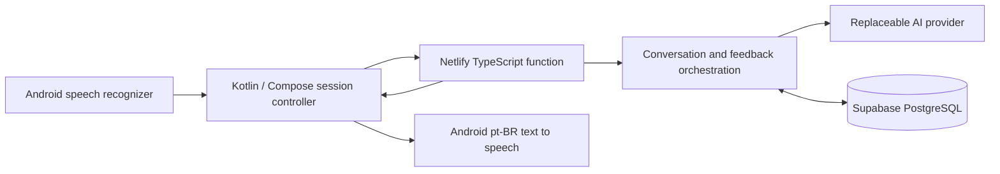

# Fala — Brazilian Portuguese conversation practice

Native Android architecture approved on 18 September 2026. Repository inspection found no existing application. The adjacent `chatbot` project supplied the provider configuration convention (`OPENAI_API_KEY`, `OPENAI_BASE_URL`, `OPENAI_MODEL`), not its WhatsApp features or database.

## A–C. Architecture, stack, and structure



One Android application and one private API function, deployable directly from GitHub to Netlify. Node 22, TypeScript, Zod for validating requests/model output, and PostgreSQL transactions for persistence. Kotlin, Compose, coroutines, and OkHttp on Android. Provider-specific code stays out of session management. A small static landing page is published separately from server code.

```
android/app/src/main/java/com/fala/app/
  MainActivity.kt          simple screens and permission request
  SessionController.kt     voice/session state and lifecycle
  data/                    HTTP API and device connection settings
  voice/                   STT and TTS interfaces + Android adapters
netlify/functions/api.ts   function entry and warm connection reuse
src/
  api.ts                   authentication and HTTP routes
  config.ts                server-only configuration
  auth.ts                  Google token verification, nonces, hashed sessions, login limits
  models.ts                validated contracts
  provider.ts              AI interface and compatible HTTP adapter
  prompts.ts               Brazilian conversation and coaching rules
  service.ts               session orchestration
  store.ts                 PostgreSQL transactions and learner memory
  database.ts              transaction-pooler-compatible connection
supabase/migrations/       private schema, constraints, indexes, RLS
tests/                     PostgreSQL-backed API and provider checks
public/                    static landing page and logo
docs/
```

## D–E. MVP and exclusions

MVP: onboarding and microphone permission, a short adaptive spoken assessment, one Talk action, turn-based voice conversation with automatic listening, tap-to-interrupt playback, recognition retry, English/Hebrew rescue, optional transcript, session history, up to three corrections, personal mistake memory, and progress based on real sessions.

V1 excludes iOS, subscriptions, games, XP, generic flashcards, fully offline conversation, automatic simultaneous barge-in, streaming speech-to-speech, and phoneme-level pronunciation scores. Google Credential Manager sign-in identifies each learner by the signed Google subject, never by email. A one-time server nonce prevents login replay. Device sessions are random, hashed in PostgreSQL, encrypted by Android Keystore, revocable, and expire after 90 days. All learner reads, writes, history, aggregates and AI context are scoped to the authenticated user. Google client IDs and service URLs are public configuration; provider/database/operator secrets remain server-side.

Public signup has per-IP/global login throttles, a 30/minute per-user conversation limit, and configurable per-user/app daily limits. These constrain requests, not monetary spending. The optional operator token accesses only diagnostics and the isolated legacy learner.

## F–G. Risks and voice architecture

`SpeechInput` and `SpeechOutput` are replaceable interfaces. The first adapters use Android SpeechRecognizer and TextToSpeech with explicit pt-BR. A Brazilian voice is required; do not silently select pt-PT. Prefer on-device recognition when available; the user may opt into their installed network recognition service. Language support is device-dependent; offer retry/settings rather than fabricate transcripts.

State: idle → requesting → speaking → listening → recognizing → requesting. Stop recognition before playback. Start listening only after playback completes. A microphone tap cancels playback and starts a new recognition request. Silence returns to an actionable state rather than spinning forever. Backgrounding pauses audio; foregrounding requires an explicit resume. Request IDs and cancelled callbacks prevent stale audio from restarting listening.

No application audio files are created or uploaded. Android's selected speech service may send audio to its provider; disclose this before consent. The text backend receives transcripts, not audio. No reliable pronunciation claim can be made from these transcripts. Speech duration is an approximate measurement between recognition speech callbacks, not a precision fluency score.

Primary risks: recognition errors mistaken for learner errors, unsupported pt-BR voices, cellular latency, platform audio interruptions, and model overcorrection. Initial objective: ten consecutive voice turns on a real Android phone without typing. Measure recognition-to-playback latency on the device; do not promise a latency target before measurement.

## H. AI conversation architecture

The AI provider accepts a task, bounded session context, current learner profile, and at most three due weaknesses. It returns validated structured data. The initial adapter implements the Chat Completions wire format, matching the existing chatbot's Groq setup. URL, key, and model are runtime server settings. No vendor SDK or provider key is bundled in Android.

Conversation instructions prefer short, natural Brazilian speech, one question at a time, fluency over perfection, and gradual adaptation. An unknown learner is not assigned a beginner level. Assessment starts with an open-ended introduction and probes past events, plans, comprehension, and opinions over several turns. Estimates remain provisional. Comprehension is inferred only from responses; vocabulary, grammar, and sentence construction require quoted evidence. Pronunciation and confidence are not scored from text. Fluency notes must state the limitations of recognition timing.

Help is a distinct turn type. The learner expresses intent in English or Hebrew; the model produces a natural Portuguese sentence, one brief explanation, and an invitation to say it. The next turn is Portuguese practice, not another translation. Assistance is recorded separately from spontaneous production.

Feedback is separate from conversation and limited to three evidenced corrections. Quotes must occur in the learner's actual Portuguese turns. No-op corrections are dropped. Valid expressions such as “Eu tenho 44 anos” must not be corrected. No minimum correction count: a clean session should stay clean. Review phrases come from accepted corrections or help requests; never fill a quota with random vocabulary.

## I. Learner memory and deletion

PostgreSQL entities in the private `fala` schema include `users`, `device_sessions`, `login_challenges`, `auth_rate_limits`, `usage_limits`, and the learning tables below. Sessions reference their owning user; `(user_id, request_id)` is unique. Original single-user records belong to a separate legacy operator account.

Learning tables:

| Entity | Stored information |
|---|---|
| Session | ID, kind, topic, start/end, provisional assessment and feedback |
| Turn | Stable request ID, learner/partner text, help flag, approximate speech milliseconds |
| Mistake evidence | Source session, source quote, natural phrasing, category, stable construction key, explanation, example |
| Profile | Latest assessment derived from retained sessions; no assumed starting CEFR |

Mistakes are aggregated by normalized construction key. Occurrences count distinct sessions, not repeated processing. Due dates bring weaknesses into later natural conversations. Initial recurrence uses a conservative next-day schedule; successful retrieval and interval expansion are a later phase, not a claimed feature. Help situations remain visible in session history and progress. Review material is tied to its source evidence.

Deleting a session cascades to its turns and memory evidence; aggregates and profile are recomputed. Delete-all removes only the signed-in learner's records. Account deletion also removes their user row and all device sessions; cascades remove their conversations/evidence. Other learners are unaffected. This is logical database deletion, not physical erasure of PostgreSQL storage, backups, or external provider logs. Configure backup retention separately. Application code does not log transcripts or raw database/provider errors. Android backup is disabled, and the device access token is encrypted with Android Keystore.

Every mutation takes a transaction-scoped PostgreSQL advisory lock derived from the authenticated user ID. After locking it verifies the account still exists, preventing an in-flight request from recreating data after account deletion. This coordinates independent Netlify instances through Supabase's transaction pooler. Request IDs and original normalized payloads make start/turn retries idempotent; conflicting reuse returns 409. Report and evidence writes commit together. For each learner, a short transaction spans the bounded AI call; no transaction stays open between spoken turns. The DB lock is tried without waiting, so competing requests can retry. A module-scoped pool uses at most one connection per warm instance with prepared statements disabled. Different learners use different locks. Database connection capacity and production throughput still require load measurement; no multiuser scale guarantee is made.

Supabase's public roles have no access to `fala`; all tables have RLS enabled with no public policies. A server-only owner connection accesses them. No Supabase secret or AI key is sent to Android. Connection setup is in [deployment](deployment.md), including Personal-plan region constraints and Haifa latency measurements.

## J. Phases and acceptance

1. **Voice slice:** Android build; connect; Talk; ten real spoken turns; denial, silence, interrupted playback, network failure, and resume behavior.
2. **Coaching:** short assessment; rescue in English and Hebrew; return to spoken Portuguese; no correction of valid age statements.
3. **Memory:** idempotent feedback; evidenced mistakes reappear in context; history/progress; session/all-data deletion verified across restarts.
4. **Device validation:** real phone and speaker/headset tests; Brazilian voice selection; network changes; latency measurement; private installation instructions.

Automated server tests can validate orchestration, privacy, persistence, and provider failure behavior. They cannot validate microphone recognition, Brazilian voice naturalness, or conversational quality on a physical device.

## Sources checked

- [Android speech recognition](https://developer.android.com/reference/android/speech/SpeechRecognizer)
- [Android speech playback](https://developer.android.com/reference/android/speech/tts/TextToSpeech)
- [AGP 8.13 compatibility](https://developer.android.com/build/releases/agp-8-13-0-release-notes)
- [Structured JSON output](https://developers.openai.com/api/docs/guides/structured-outputs) — application validation remains necessary.
- [Provider data controls](https://developers.openai.com/api/docs/guides/your-data) — disabling application storage is not a guarantee of zero provider retention.
- [Groq reasoning configuration](https://console.groq.com/docs/reasoning) — low reasoning effort is used for the existing GPT-OSS configuration to limit turn latency; latency still needs measurement.
